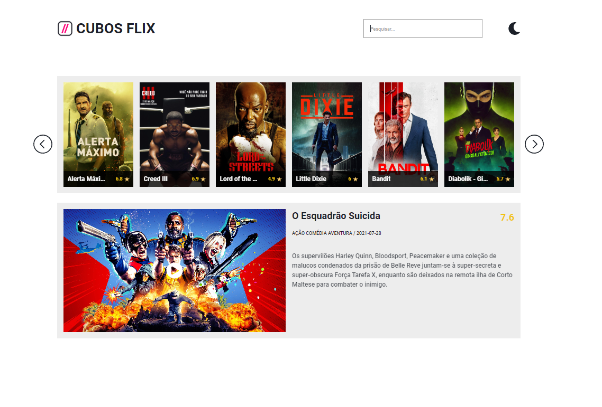
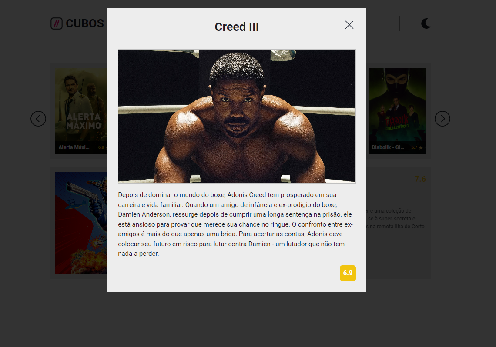

# Projeto-de-Carreira

###README
Este projeto é um website de filmes em que são exibidos os destaques do dia e os filmes mais populares do momento.

A página web é desenvolvida utilizando JavaScript e a API TMDB. A biblioteca Axios é utilizada para realizar as requisições na API.

O website é responsivo e tem uma estruturação em carrossel para a exibição dos filmes. Além disso, é possível visualizar um destaque do dia.

Baixe o código do repositório em seu computador e abra-o em um editor de código de sua preferência.
Abra o terminal na pasta do projeto e execute o comando npm install para instalar as dependências do projeto.
Para iniciar o projeto, execute o comando npm start no terminal. O website será aberto no navegador.

###Funcionamento

###Destaque do dia

A função dayMovie() é responsável por exibir o destaque do dia. Ela realiza uma requisição na API e retorna as informações do filme que está em destaque. As informações do filme são exibidas na página principal.

###Filmes mais populares
A função loadData() é responsável por exibir os filmes mais populares do momento. Ela realiza uma requisição na API e retorna um array com os filmes. As informações dos filmes são exibidas na página principal em um carrossel.

###Carrossel
O carrossel é composto por três carrosséis menores que exibem seis filmes cada. Os filmes são divididos em três carrosséis para facilitar a navegação do usuário.

O usuário pode navegar pelos carrosséis utilizando as setas laterais. As informações dos filmes são exibidas no carrossel ao passar o mouse sobre o filme.

###Modal
Ao clicar em um filme, um modal é exibido com mais informações sobre o filme. As informações são exibidas em uma janela pop-up que aparece ao clicar no filme.git

